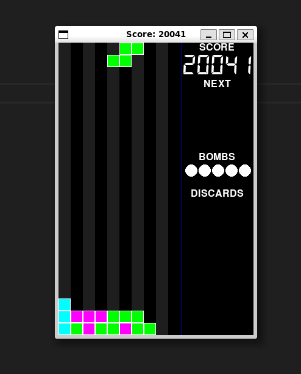
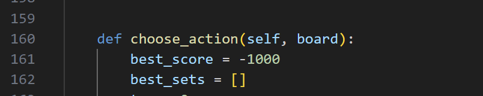

# Tetris AI Designed by Zhouzhou Zhang Nov 2024
A simple AI using decision tree to play Tetris automatically

## Run and Compile
Recommended: python3 visual-pygame.py

Works as well: python3 visual.py

## Introduction
-I am happy now you don't have to write it on you own

-The interface is implemented on OOP

-Algorithm is written in a function in Player.py

-400 blocks in total

-Discard and bombs supported

-25 score for one-line-elinmation, while 1600 for four-lines

## Feature
-Performance: Over 20,041 and still a long way to go!

-Clearness: Easily understand

-Short: Only 200 lines of coding

## Files Included
-Player.py: Where implements the AI and you should really care about

-Board.py: Where implements the game board

-All the other files: You do not need to care about

## Algorithm
-Iterates every possible choice using thousands of cloned game board

-Go through a decision tree and find the best choice

-Return the choice to the interface

# FULL TUTORIAL
Let's begin the implentation step by step!

Notice, I am not going to let you copy the source code...

but I will guide you on what and how to write the functions you needed and compose them

Other word, I will teach you how to think

## 1.Understand the framework of Interface
First, you need to know that, the game will only listen to the "commands" returned by function <choose_action> in Player.py

So, this is the only file you should care about.

Second, you have to know that, the "real game" and the "game board" is different.

The real game is changed only when you return the "commands"

The game board is changed only when the AI is "thinking", or may say, "iterating every possible choice"

Third, choose_action is called every time the block is able to move

Hence, in choose_action, this is where AI iterates every possible choice, and then return the best commands

Additionally, the commands can be a set, not just a single command

You can tell the AI to "Turn right, and then go down"

So, rather than iterate one choice, we should iterate every possible "set" of choice!

For example, "Rotate, rotate, go left, go left and go down", rather than "rotate"

## 2.Build the framework of algorithm
Now let's figure out how to let AI "think"

First, he creates a virtual game board in his "head", where so far everything is exactly the same as the real game

    clone_board = board.clone()
    
Then, he tried to move the block, and he will remeber his every move so that he will know what to do when coming back to the real game

    move_the_virtual_block(clone_board)
    drop_the_virtual_block(clone_board)

Then, the virtual board got a new status, which means now, the virtual board is different from the real board.

The block has already landed at AI's head, but still hang in the sky at real game!

Meanwhile, if there is eny line-elinmination, it will also affect the virtual board. For instance, the virtual board may have less cells than the real board because of the line-elinmination.

So Hey, what should AI do? AI should check this virtual board, and score it, then determine whether it is better than any virtual board he made before!

    score = score_the_board(clone_board)
    if score > best_score:
        best_score = score

And now, AI find the virtual board with best score...

but, how can he turn the virtual board into the reality?

Notice, the virtual board is exactly the same as the real board.

So, AI should remeber what he has done, in other word, commands he has made, in that best virtual board. Assuming the function would return a command, maybe we can store the command into a list, say, a list named "memory".

    memory = move_the_virtual_block(clone_board)
    memory += drop_the_virtual_block(clone_board)

And then, he will need this memory for the virtual board which gets the best score, so let's improve the if-sentence

    if score > best_score:
        best_score = score
        best_command_sets = memory

And If this virtual board is not the best, AI throw this memory

    memory = [] //You can also do it just before you assign value to memory

After throwing the memory, AI start a new virtual board with different try

    clone_board_2...

Hey...you are not gonna repeat the code like a thousand times...right?

So what did you find? Oh hey, isn't it a loop?

Hell yeah! Let's keep improving it!

    def choose_action(self, board)
        For i in range(the_number_of_choices_):
            clone_board = board.clone()
            memory = move_the_virtual_block(clone_board)
            memory += drop_the_virtual_block(clone_board) //Actually you can merge these two functions but I do not recommend, you will know why at the end
            score = score_the_board(clone_board)

            if score > best_score:
                best_score = score
                best_command_sets = memory
            
            memory = []
        return memory

Well done! We have the framework of the whole algorithm!

### 3.(1)Break-down of move_the_virtual_block()---rotate_board()
    
Now, let's try to construct the first function needed in the algorithm.

Try thinking about, how do we human move the block.

Well, we can rotate and we can move left or right.

That's perfect, this means we can come out with at least 3 functions

Try build the function "rotate_board"!

First we gonna declare it. rotate_times stands for the time of rotation in the clockwise.

    def rotate_board(self,board,rotate_times)

Then what should we do? Notice, we take a board as parameter, so of course we are gonna do something on the board

        board.just_do_something

Well, we should care about how many times we rotate, so we do need a loop

        for i in range(rotate_times):
            board.just_do_something
            return the_command_corresponding_to_it

Think about what if we do not want to do anything? Then we just return nothing!

        if rotate_times == 0:
            return just_return_a_command_means_Nothing
        for i in range(rotate_times):
            board.just_do_something
            return the_command_corresponding_to_it

Hey, like I have said, it must to be a list, so...

        if rotate_times == 0:
            return [just_return_a_command_means_Nothing]
        for i in range(rotate_times):
            board.just_do_something
            return [the_command_corresponding_to_it]

Well done! We can move forward!

### 3.(2)Break-down of move_the_virtual_block()---move_left(), move_right()
Then we should work on the move_left and move_right

    def move_board_left(self,board, step)
    def move_board_left(self,board, step)

Notice that the block come out from the middle so the maximum number of step we can make is 5

It is you who would figure out how to build these two functions

### 3.(3)Break-down of move_the_virtual_block()
Get back to the algorithm, don't you think the way we use the for-loop is not appropiatate?

    For i in range(the_number_of_choices_):

Actually, it should be like...

    for i in range(the_number_of_choices_to_rotate):
        for j in range(the_number_of_choices_to_rotate):
            //complete the algorithm

Sweet, what a sense-maker

And then, we have two loops, right?

So we can not have only one memory and only one virtual board, wondering why?

Thinking about, in the inner for-loop, we would do different things on the memory and board

And the memory and board which AI takes from the outer loop, is already occupied with some elements.(Commands to rotate)

So how can we make sure that in the inner loop, we will not lose the commands inserted into it before?

For example, in outer loop we insert a command to rotate in the memory, and in the inner loop, we insert commands to move, but when inner loop goes to the next circle, we should delete the command to move which we have inserted before. How can you make sure you will not also delete the commands to rotate?

You may think about use a stack, will, way too much complex!

Try to do something like this...

    for i in range(the_number_of_choices_to_rotate):
    clone_1 = board.clone()
    memory_rotate = rotate_board(clone_1)
        for j in range(the_number_of_choices_to_rotate):
            clone_2 = clone_1.clone()
            memory_move = move_board_left_or_right(clone_2)

            memory = memory_rotate + memory_move
            //complete the algorithm

We can separate the memory and clone into two parts! And then they will not affect each other

Well, the disadvantage is that it costs much memory(if you know C well, on free store).

But nevermind you got 256mb when running on the server so it is totally enough!

And notice the move_board_left_or_right...

In a loop, how can AI figure out he should left or right? The directions is not like the numbers, they do not have any order

Try to use some if-sentences! It is you who will figure out this!

### 4.Break-down of score the board
And now, we can focus on the scoring system, which is the most important one.

To determine whether a virtual board is good or not, we should have many criteria.

The first one should be aggregate height, means, the sum of height of each column.

So you will need some functions

    def get_column_height(self,board)

Then...

    def get_list_of_height(self,board)

What's next?

    def get_aggregate_height(self, board)

Try to figure out how to write these function!

These functions should be like "step by step", the second function calls first one and the third one calls second one.

It is ok if you merge them into one if you are a skilled programmer

The next criteria shoule be bumpness! it can be calculated like...

    bumpness = abs(x1-x2) + abs(x2-x3) + abs(x3-x4)...

Try to figure out how to write this function

    def get_bumpness(self, board)

The third criteria is, of course, the line-elinmination

    def check_elinmination(self, board)

Well, this one, could be a little harder to build.

How could you check whether the line is eliminated?

You may not be possible to compare the total number of cells before and after.

Because once you put a new block, you can not be sure every single cell of that block will be eliminated.

I would recommend to check the "score" before and after, this "score" means the "score" in your game!

Your score add 1600 after 4 lines eliminating

    score_difference = //...
    if score_difference > //...
        //...

The final criteria, should be the holes.

Holes mean the unit that is not occupied by cell but surrounded by cells.

A hole is harmful to the game as you may not be able to elinmate it.

For this criteria, you may want to functions like

    def check_hole(self,board)
    def hole_numers(self,board)

For this part I recommend you merge them into one, which would make it a little bit easier for chained-holes.

Chained-holes stand for the holes that attached to each other.

If you only care about the holes being totally surrouned by cellls, you may be cooked...

For my hint, I strongly recommend you to check the holes column by column.(So we will use get_list_height(self,board) again!)

Now you made 4 criteria, you should determine their percentage.

How much score should I minus for the holes? and how much should I add for the line-elinmination? Try to figure out...

## 5.Integrate the choose_action(self, board)
What a long way you been through, finally you are gonna reach the end.

Try to compose these functions together and add some code to fix some special occasions!

Alright I will tell you then, when bomb.falling is None, return Direction.Down directly because you don't have any block.

You should figure out when to insert this code.

## 6.Improve your scoring system
This is how you get higher score, try different percentage for those 4 criterias!

You may have checked my code and found very strange number, well, you can copy them, but I can't be sure the number is the best.

Try to use some GA to find out the best set of numbers?

## 7.Figure out how to use discard and bomb
Now you are not a rockie in this project anymore...right?

Your next step should be on the discard and bomb.

I can't find a good way to merge them into my code.

My AI considered bomb to be always harmful, in my system, bomb gets extermely low score.

Discard can be perfectly merged into my code but the improvement is way too much little...

It is you that may figure out this!

# Some advice
If you don't know how to start, read the brief and try to understand the interface

Do not use Chat-GPT, it sucks, sucks more than UCL, it will totally destroy your code

You are not really learning Python in this project, you are just learning the interface and get pratical experience on a real world project

Keep things straight-forward! A clean code would help you a lot.

If you still don't know how to start, you can always find me in the lab...